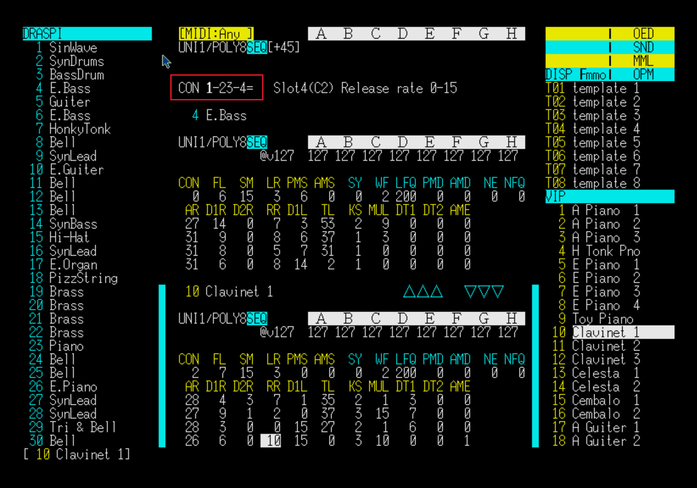

# OED Operator Topology Glyph (OTG)

OTG is a standalone DSL for describing operator topology using compact ASCII glyphs.

---

## Overview

OTG (OED Operator Topology Glyph) is a domain-specific language designed to represent operator connection structures (topology) in a concise, human-readable, and machine-interpretable form.

It was originally developed for **OPM Tone Editor (a custom FM tone editor developed by the author)** and OED (FM tone library format), but is specified here as an independent and extensible topology DSL.

---

## What You Can Describe

OTG allows you to describe:

* **Series connections**
* **Parallel mixing**
* **Feedback loops**
* **Nested structures**
* **Explicit feedback targets**

---

## Quick Examples

### Series

```
1234=
```

```
1 → 2 → 3 → 4 → output
```

---

### Parallel

```
1-2-3-4=
```

```
mix(1,2,3) → 4 → output
```

---

### Feedback

```
@1
```

```
1 → 1
```

---

### Group Feedback

```
@(12)3=
```

```
1 → 2 → 1
2 → 3 → output
```

---

### Feedback Target (`$`)

```
@(1-$2-)3=
```

```
mix(1,2) → 2
mix(1,2) → 3 → output
```

---

## Real Device Example

OTG can represent real FM synthesizer algorithms.

Example (Yamaha DX7):

```
alg1: @6543=21=
```

See full tables:

* [DX7 algorithms](examples/dx7.md)
* [YM2151 / YM2203 algorithms](examples/ym2151_ym2203.md)

---

## Real-World Usage

OTG is already used in OPM Tone Editor:



---

## Design Goals

* **ASCII-only representation**
* **Human-readable**
* **Machine-interpretable (AST / graph)**
* **Device-independent**
* **Operator-count independent**
* **Extensible (future topology systems)**

---

## Canonical Form

OTG allows multiple equivalent expressions for the same topology.

However, a **canonical form** can be defined per device by:

1. Preserving exact topology
2. Unifying operator ordering (ascending / descending)
3. Minimizing redundant syntax

---

## Why OTG Exists

OTG was originally developed to solve limitations of traditional FM algorithm representation:

* Numeric algorithm IDs are opaque
* Topology is not explicitly visible
* Difficult to extend beyond fixed device definitions

OTG replaces numeric identifiers with explicit structural representation.

For design background and philosophy:

→ [Design Rationale](docs/rationale.md)

---

## Specification

Full syntax and semantics:

→ [Specification (draft version 0.01)](spec/otg-spec-v0.01.md)

---

## Examples

* [DX7 algorithms](examples/dx7.md)
* [YM2151 / YM2203 algorithms](examples/ym2151_ym2203.md)

---

## Implementation Notes

OTG is designed to be easily implemented:

* tokenizer: `$`, `[ ]` support required
* parser: recursive descent recommended
* AST: operator / group / parallel / feedback
* graph: edge-based construction

---

## Related Documents

- [Specification](spec/otg-spec-v0.01.md)
- [DX7 Examples](examples/dx7.md)
- [YM2151 / YM2203 Examples](examples/ym2151_ym2203.md)
- [Design Rationale](docs/rationale.md)

---

## Status

**draft version 0.01**

This specification is subject to future refinement.

---

## License

MIT License
